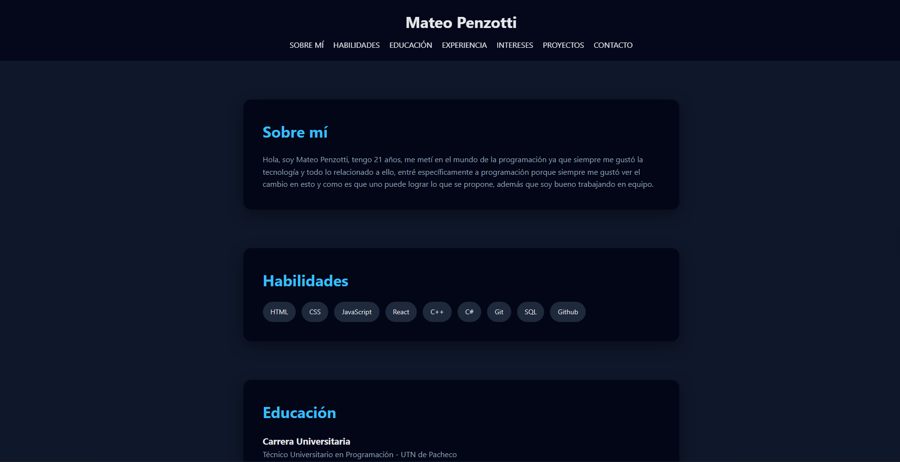

# 🧑‍💻 Portfolio — Mateo Penzotti

Sitio web personal de portfolio desarrollado con HTML, CSS y JavaScript puro. Permite a reclutadores y contactos conocer mi perfil, habilidades, educación y experiencia.

---

## 🚀 Demo en vivo

> Próximamente / [Ver en GitHub Pages](https://mate0444.github.io/PROYECTO-FINAL-PORTFOLIO/)

---

## 📸 Vista previa



---

## ✨ Características

- Navegación suave con scroll animado hacia cada sección
- Header sticky con efecto de blur (glassmorphism)
- Diseño responsive para mobile, tablet y desktop
- Paleta de colores oscura con acento en celeste (`#38bdf8`)
- Íconos de tecnologías en el footer

---

## 🛠️ Tecnologías utilizadas

| Tecnología | Uso                            |
| ---------- | ------------------------------ |
| HTML5      | Estructura del sitio           |
| CSS3       | Estilos y diseño responsive    |
| JavaScript | Lógica de scroll animado       |

---

## 📁 Estructura del proyecto

```text
portfolio/
│
├── index.html        # Estructura principal del sitio
├── style.css         # Estilos globales y responsive
├── app.js            # Lógica de scroll
├── icons8-html-5.svg
├── icons8-css-logo.svg
└── icons8-javascript.svg
```

---

## ⚙️ Cómo correrlo localmente

1. Cloná el repositorio:

   ```bash
   git clone https://github.com/mate0444/portfolio.git
   ```

2. Abrí el archivo `index.html` en tu navegador.

> No requiere instalación de dependencias ni servidor backend.

---

## 📖 Secciones del sitio

- **Sobre mí** — Presentación personal
- **Habilidades** — Stack tecnológico
- **Educación** — Carrera universitaria y cursos
- **Experiencia** — Trabajos anteriores
- **Intereses** — Pasatiempos y áreas de interés
- **Proyectos** — Proyectos actuales y futuros
- **Contacto** — Email directo

---

## 📄 Licencia

Este proyecto es de uso personal. Podés tomarlo como inspiración, pero por favor no lo copies tal cual para presentarlo como tuyo.

---

Hecho con 💙 por Mateo Penzotti.
